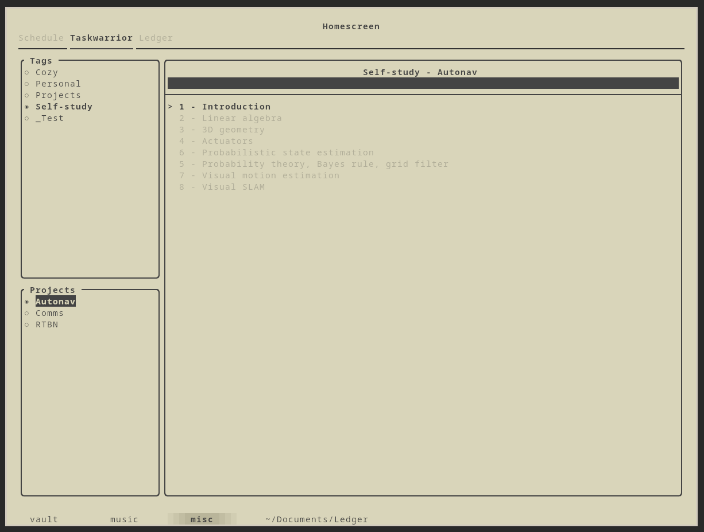

Homescreen
-------------

I made a nice-looking dashboard using AwesomeWM (arguably the worst possible UI framework that I could've picked). I'm rewriting it as a TUI. Less pretty, but hopefully much more performant.

This is a heavy work in progress and not currently in a usable state. I'm also rusty with C++, so users beware.

## Preview

## Build
~~~bash
mkdir build
cd build
cmake ..
make -j
./homescreen
~~~
